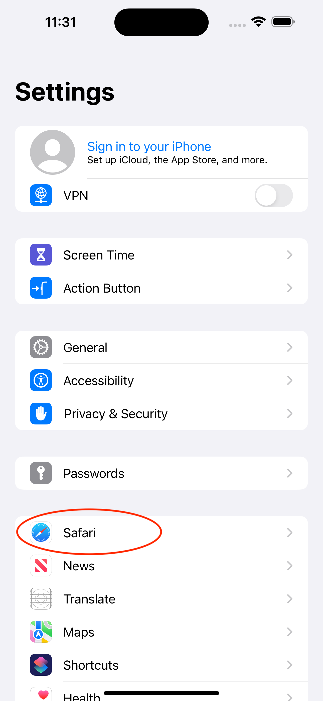
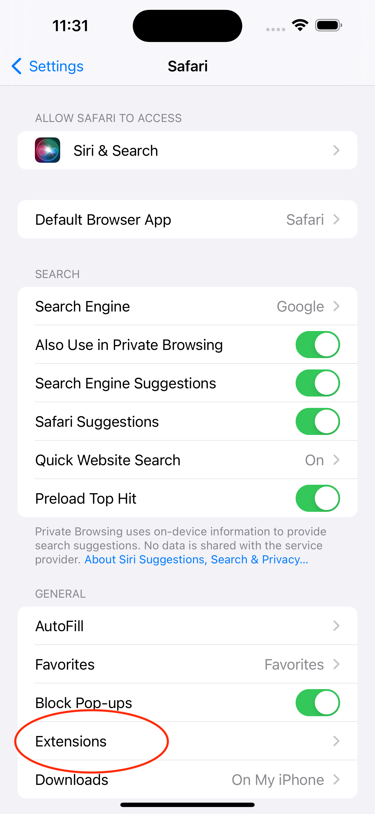
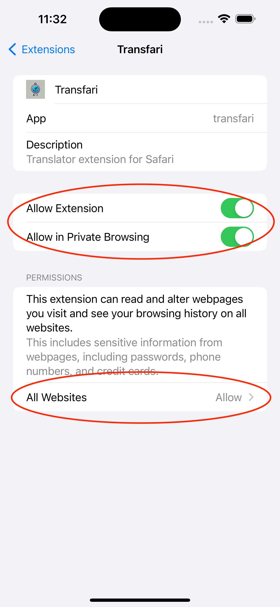

  

# Transfari

Transfari is a lightweight, free and open source translation extension designed for Safari.
I just arrived in Sweden and Safari's built-in translation can't translate Swedish websites.
And I don't wanna use Chrome for privacy reasons. When I looked up in the App Store most translation extension are paid options. So I wrote this with the help of ChatGPT. Enjoy it.

## Translation Engines Supported:
Google Translate 

Google Cloud Translation API (bring your own key)

DeepL Free Translation API (bring your own key)

## How to use:
Download the app.

### iOS
[]
[]
[]
### macOS
Open the app.

Follow in-app instructions.

It is recommended to give Transfari access to all websites.

## Privacy Concerns:
This app does not collect any information on its own. However, the webpage you choose to translate will be sent to Google/DeepL depending on your choice. You can verify the privacy promise by inspecting the source code and reverse engineering the App Store build however you want.

## To-Dos:
An in-app tutorial.

Better UI.

Better error prompt.

Fix broken auto-translate.